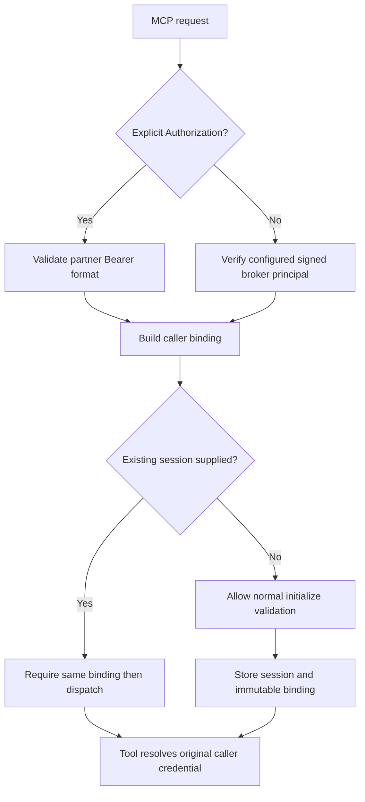

# Authenticate Expensify MCP requests and sessions

## Summary and problem

Restore the existing Expensify HTTP MCP safely by authenticating every MCP request and binding each session to its original caller. Preserve the assigned tenant's direct partner-credential Bearer contract and the existing signed broker principal contract.

The selected deployment candidate trusts an anonymous fallback principal, accepts unsigned supplied principals when HMAC is absent, and forwards existing session requests before checking credentials. The broker then signs and resolves the principal supplied by this MCP; its namespace isolation does not authenticate the upstream caller. A malformed raw credential also throws out of an Express 4 async route. These are source-confirmed deployment blockers; no active compromise or live vault contents were inspected.

## Requirements

**Request admission**

- R1. Every POST, GET and DELETE at `/mcp` requires either structurally valid explicit partner credentials or a verified broker principal signature before any session access, transport dispatch or external request.
- R2. Broker mode requires its existing install configuration and a configured HMAC key. Missing principal, missing/invalid signature and anonymous fallback are refused; explicit invalid Authorization never falls back to broker mode.
- R3. Direct Bearer credentials retain supported first-colon and JSON partner field formats, with nonempty string validation and generic malformed-input responses. Authentication failure cannot crash the process or expose submitted credentials.

**Session authority and compatibility**

- R4. Session use and termination require the same authentication mode and credential identity that initialized it. A valid different caller, missing credentials or changed credentials cannot invoke the original resolver, read its stream or close it.
- R5. Correctly authenticated clients retain initialize, notifications, tools/list, tools/call, GET stream and DELETE lifecycle behavior. Broker credentials resolve on each tool call and authenticated disconnected users retain `connection_required`.
- R6. Responses and logs omit raw credentials, signatures and private upstream error bodies. Session IDs appear only in the required MCP protocol response header; health/error bodies and routine logs remain session-ID-free. Public health reports readiness without claiming an unsigned broker is usable.

## Scope and assumptions

This change is confined to this Expensify service. It introduces no new broker namespace, credential store, OAuth system, service/domain, tenant assignment or platform gateway protocol. Existing tool names and business behavior remain. There is no fleet-wide migration or provider write qualification.

The operator reports the assigned tenant currently supplies direct Bearer partner credentials. That credential ownership model remains: the caller brings its own provider secret, and the provider validates it when used. Structural admission does not claim to authenticate a Finney user. This bounded repair does not claim full OAuth MCP authorization conformance. Signed principal headers remain bearer-equivalent proofs over TLS; expiry/replay-resistant gateway signatures require coordinated changes outside this repair.

## Key technical decisions

- KTD1. Add one request admission function used before all three MCP methods. Explicit Authorization selects direct mode first. Accept only Bearer syntax; parse a first-colon credential or a JSON object using the existing `partnerUserID`/`partnerUserSecret` and `id`/`secret` aliases. Reject malformed JSON, non-string/empty fields and oversized input with safe 400; reject unsupported/empty auth schemes with 401. Preserve embedded colons in the secret. No alternate mode is attempted after explicit auth failure.
- KTD2. With no Authorization, require a nonempty principal and the current HMAC-SHA256/base64url signature; preserve the configurable principal header name and fixed signature header. Verify a bounded canonical signature with constant-time comparison. Missing broker configuration or signing key yields safe 503 for broker-mode requests; invalid proofs yield 401. Remove fallback principal behavior even if the legacy environment variable exists. Direct mode works with broker mode disabled. The broker itself only verifies this MCP's signed JWT, so admission must happen here.
- KTD3. Bind sessions to immutable local identity: mode plus a process-keyed digest of the canonical credential pair for direct mode, or verified principal for broker mode. Do not persist or log this binding. Equivalent supported credential encodings may resolve to the same pair. Recheck proof on every HTTP request and compare binding before invoking the session transport. No mutable per-session current-caller variable: concurrent calls cannot switch another call's resolver.
- KTD4. Retain stateful SDK transport and random session IDs. A supplied unknown session ID returns 404 after admission and never creates a replacement session. Requests without a session may create one only through normal SDK initialize validation. Register successful sessions at the SDK initialization lifecycle point and clean partially initialized transports on failure; authenticated DELETE and transport close remove state without double-close races. Rejected requests create no sessions and cannot close existing ones. Process restart invalidates all sessions and clients reinitialize normally.
- KTD5. Extract an app factory and small auth module while keeping `src/index.ts` as the production listener. Inject bounded dependencies for isolated tests, not new runtime control endpoints. Catch Express 4 async rejections and normalize JSON-parser/transport errors at the boundary. Convert broker/provider failures to fixed messages or status codes, never include upstream response bodies or exception text containing submitted content. Preserve safe `connection_required` output for genuine broker 404.
- KTD6. Keep the existing broker-first transport but describe `brokerConfigured` as install configuration only; add a safe broker-ready indication requiring HMAC configuration and update auth-mode text. Correct the unrelated Banking description to Expensify reports/policies while documenting the changed authentication requirement. No secret values, principal names or session IDs enter health or routine logs.

The session boundary follows the [MCP session hijacking guidance](https://modelcontextprotocol.io/docs/2025-11-25/tutorials/security/security_best_practices#session-hijacking): possession of a session ID is insufficient. Explicit async error containment follows [Express error-handling guidance](https://expressjs.com/en/guide/error-handling/); automatic Promise rejection forwarding is an Express 5 feature, while this service uses Express 4.

## Request flow

Each validation failure returns before transport, session creation or external requests. A tool call through direct mode uses only the submitted credential identity; broker mode signs only the authenticated principal.

## Implementation units

### U1. Request authentication and safe app boundary

Covers R1-R3, R6. Files: `src/auth.ts` (new), `src/app.ts` (new), `src/index.ts`, `src/broker-client.ts`, `src/api-client.ts`, `test/auth.test.ts` (new), `test/http-auth.test.ts` (new), `package.json`.

Extract the app without changing tool contracts. Introduce strict credential/principal admission, invoke it on every MCP method before dispatch, and contain parser/async/upstream errors. Retain normal broker token resolution, but prevent arbitrary response bodies from crossing the error boundary. Use the existing Node/tsx development stack and Node test runner; no new test framework is necessary. Add request tests first because this area currently has no automated test command.

Tests:

1. Both supported direct formats, aliases and colon-containing secrets reach a mock provider with the exact expected partner fields, including when no broker/HMAC configuration exists.
2. Missing/blank principal, signature without principal, malformed/wrong/missing signature and missing HMAC key refuse broker mode with zero broker/provider invocations; a valid signature selects only the intended principal.
3. Bad auth scheme, malformed JSON, absent/non-string/empty credential fields and oversized input return bounded generic errors and no outbound requests. Explicit invalid Authorization plus valid broker proof still refuses.
4. Malformed request JSON and rejected provider/broker/transport promises do not crash or expose canaries in HTTP/MCP response or captured logs; a subsequent valid request succeeds.

### U2. Immutable session caller binding

Depends on U1. Covers R4-R5. Files: `src/app.ts`, `src/auth.ts`, `test/mcp-sessions.test.ts` (new), shared fixture helpers under `test/` only if needed.

Bind the server's captured resolver to its initialized identity and gate all session operations with fresh proof. Keep SDK lifecycle semantics and close partial transports on failure. Use isolated loopback HTTP with the real MCP SDK transport/client and fetch spies for broker/provider endpoints; never use real credentials, broker namespaces or provider calls.

Tests:

1. Legitimate initialize, initialized notification, tools/list and `policies_list {}` succeed for raw and signed broker clients, with exact mock provider credential and broker principal assertions. Broker connected and 404 not-connected results preserve their established distinction.
2. Create A and B sessions for both auth modes. Attempt A's session using no auth, B's credentials, altered raw secret, another signed principal and the other auth mode for POST/GET/DELETE. Every attempt is refused before transport or external invocation; A remains usable and B never receives A's data.
3. Authenticated GET attaches only to its own stream; unauthenticated/changed-caller GET returns immediately without opening it. Authenticated DELETE removes only its session; later requests get404 and proper reinitialization succeeds.
4. Concurrent valid A/B calls keep their original identities; changed credentials do not rewrite captured resolver state. Unknown supplied ID, non-initialize request without ID and failed initialize create no retained session.
5. Raw headers remain required after initialization even when signed broker headers are also configured; legitimate raw mode is not silently switched by GET/DELETE.

### U3. Deployment contract and qualification

Depends on U1-U2. Covers R5-R6. Files: `.env.example`, `README.md` (new), `package.json`, `test/startup.test.ts` (new); `Dockerfile` only if an actual build inclusion issue requires it.

Document supported credential formats, per-request headers, session ownership, broker readiness and rejection of legacy fallback/unsigned mode. Keep production Node20 build/start entrypoints. Run build, focused tests and a compiled-process startup test with isolated mock dependencies; no provider calls in tests. Check the existing Docker multi-stage build still copies all compiled modules.

Tests and qualification:

1. Compiled server starts on an ephemeral local port with broker disabled; health describes raw availability and unavailable broker accurately. Malformed auth does not kill it; initialization/listing with fixture raw credentials still works.
2. Review all diff and test output for accidental secret, signature or session-ID logging. Public root/health contains accurate Expensify copy and readiness booleans only.
3. After independent code review, the operator deploys the immutable approved commit to the existing Railway service/environment. Verify successful deployment, health and negative auth probes, then normal initialize/tools-list followed by exactly one cloud-forwarded `policies_list {}` on the original agent/account. No export, policy update or financial mutation is used for proof.

## Risks and rollout

Unsigned broker consumers will now fail closed and need a matching gateway/service HMAC key before broker use; do not restore fallback to make a probe pass. Existing direct partner credentials and their tenant URL need no change. Old sessions disappear on restart and must reinitialize; no persisted migration is required. If deployment qualification fails, stop rollout and diagnose; do not roll back to the unauthenticated candidate as a usable production fallback.

This source has Node20, Express4 and MCP SDK1.27 dependencies and no existing test suite or institutional `docs/solutions/` collection. Local review of the broker's actual JWT and token routes confirmed that the downstream broker trusts this service's principal assertion. A current live environment/vault inventory is not a prerequisite to proving the source defect, but deployment readiness and the one authorized read remain operational evidence to collect separately.
